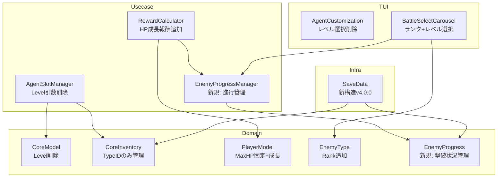
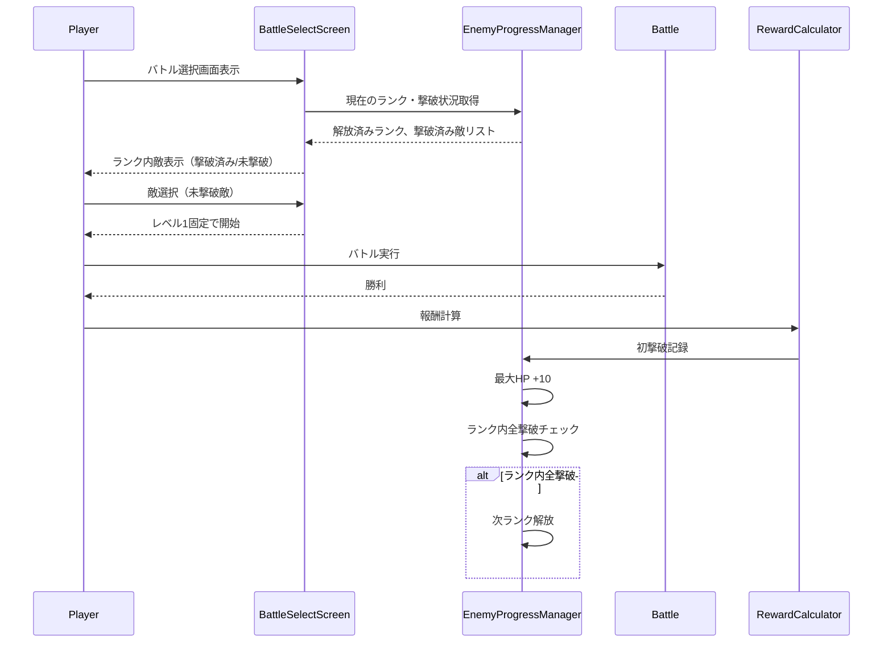
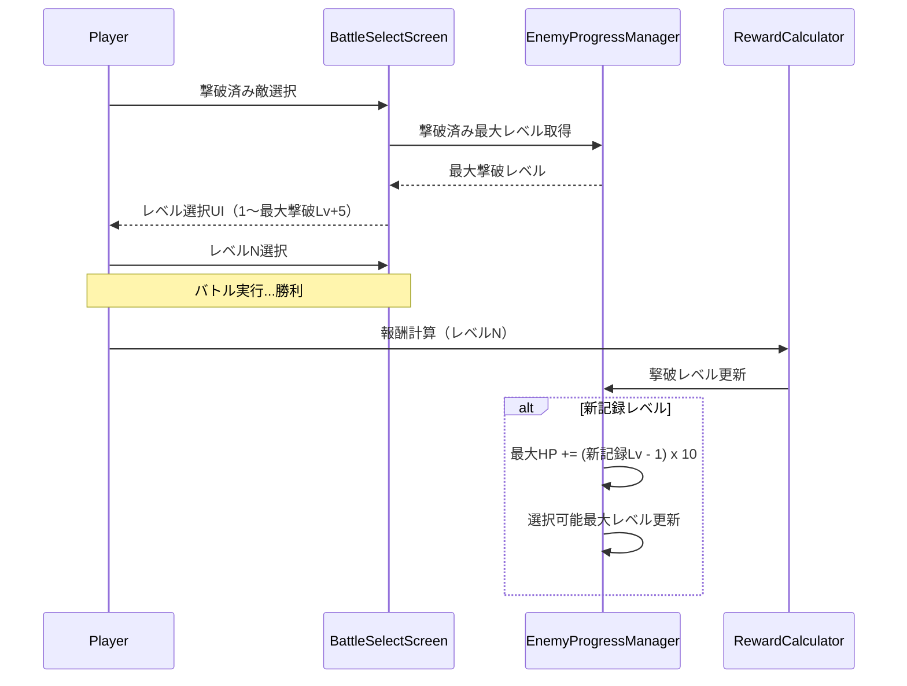
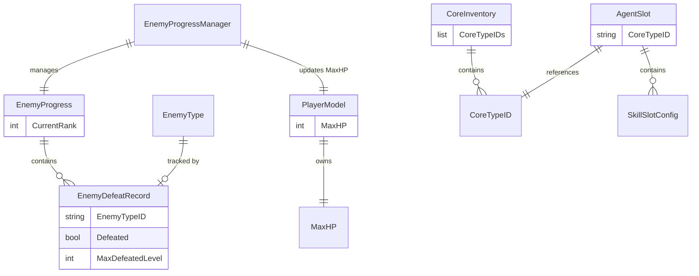

# Design Document

## Overview

**Purpose**: コアレベルシステムを廃止し、敵ランクベースの進行システムを導入する。これにより、エージェント構成がシンプルになり、プレイヤーの成長が敵撃破に直接連動する。

**Users**: プレイヤーは敵をランク順に撃破して進行し、撃破済み敵の高レベル挑戦でさらなる成長を得る。

**Impact**:
- コアからレベル概念を削除し、ステータス計算を重みベースの固定値に変更
- プレイヤー最大HPを敵撃破実績に連動させる
- 敵選択UIをランクベースに再設計
- セーブデータ形式を変更（後方互換性なし）

### Goals
- コアレベルに関するすべてのコードとUIを削除
- エージェントステータスを「100 x コアの重み」で固定計算
- 敵ランクシステムによる段階的進行の実現
- 敵撃破による最大HP成長システムの導入
- 撃破済み敵のレベル選択による高難度挑戦

### Non-Goals
- 旧セーブデータとの後方互換性維持
- コアレベルに代わる新たな成長要素の追加
- 敵AIや行動パターンの変更

## Architecture

### Existing Architecture Analysis

現在のアーキテクチャ:
- **domain層**: CoreModel.Level、CalculateStats(level, coreType)がレベルベース計算
- **usecase/slot**: AgentSlotManager.SetCoreがlevel引数を受け取り、インベントリの最大レベル範囲で検証
- **domain**: PlayerModel.RecalculateHPがエージェントのレベル平均から最大HPを計算
- **infra/savedata**: AgentSlotSave.CoreLevelでレベルを永続化
- **tui/screens**: agent_customization.goにModeLevelSelect（レベル選択モード）が存在
- **tui/screens**: battle_select.goで撃破状況に基づくレベル選択UI

### Architecture Pattern & Boundary Map



**Architecture Integration**:
- **Selected pattern**: 既存の5層レイヤードアーキテクチャを維持
- **Domain boundaries**: EnemyProgressを新規ドメインモデルとして追加、PlayerModelに成長ロジックを追加
- **Existing patterns preserved**: Managerパターン（新規EnemyProgressManager）、ユニークインベントリパターン
- **New components rationale**: EnemyProgressは敵撃破状況という独立したドメイン概念を表現
- **Steering compliance**: domain層の独立性、usecase層でのManager配置を維持

### GameState統合方針

**現状**: `usecase/session/game_state.go` に `defeatedEnemies map[string]int` が存在

**変更方針**:
1. `GameState.defeatedEnemies` フィールドを削除
2. `GameState` に `EnemyProgress *domain.EnemyProgress` フィールドを追加
3. 既存の `DefeatedEnemyProvider` インターフェースは `EnemyProgressManager` に置換

```go
// 変更前
type GameState struct {
    MaxLevelReached    int
    defeatedEnemies    map[string]int  // 削除
    // ...
}

// 変更後
type GameState struct {
    EnemyProgress *domain.EnemyProgress  // 新規
    // MaxLevelReached は削除（EnemyProgress.CurrentRankに置換）
    // ...
}
```

**理由**:
- Single Source of Truth: 敵撃破状況の管理を`EnemyProgress`に一元化
- 責務の明確化: `GameState`はセッション状態の集約、`EnemyProgress`は進行状況の詳細管理

### Technology Stack

| Layer | Choice / Version | Role in Feature | Notes |
|-------|------------------|-----------------|-------|
| Backend / Services | Go 1.25+ | 全てのロジック変更 | 既存スタック維持 |
| Data / Storage | JSON (savedata) | v4.0.0セーブ形式 | 後方互換性なし |
| Frontend / CLI | bubbletea, lipgloss | UI変更 | 既存スタック維持 |

## System Flows

### 敵ランク進行フロー



### 撃破済み敵の高レベル挑戦フロー



## Requirements Traceability

| Requirement | Summary | Components | Interfaces | Flows |
|-------------|---------|------------|------------|-------|
| 1.1-1.4 | コアレベル廃止 | CoreModel, CoreInventory, AgentSlotManager | SetCore(typeID), AddCore(typeID) | - |
| 2.1-2.3 | ステータス計算変更 | CoreModel, StatsService | CalculateStats(coreType) | - |
| 3.1-3.5 | レベル関連機能削除 | AgentSlotManager, AgentCustomization, RewardCalculator, SaveData, Encyclopedia | 各種UI/データ操作 | - |
| 4.1-4.2 | 最大HP初期化 | PlayerModel, SaveData | NewPlayer(), NewSaveData() | - |
| 5.1-5.2 | 敵レベル初期化 | EnemyType, EnemyGenerator | NewEnemy() | - |
| 6.1-6.5 | 敵ランクシステム | EnemyType, EnemyProgress, EnemyProgressManager, BattleSelectScreen, SaveData | GetCurrentRank(), UnlockNextRank() | ランク進行 |
| 7.1-7.3 | 初撃破HP増加 | EnemyProgressManager, PlayerModel, RewardCalculator | RecordFirstDefeat() | 初撃破報酬 |
| 8.1-8.4 | 撃破済みレベル選択 | BattleSelectScreen, EnemyProgress, SaveData | GetSelectableLevelRange() | 高レベル挑戦 |
| 9.1-9.3 | 高レベル撃破HP増加 | EnemyProgressManager, PlayerModel, RewardCalculator | RecordHighLevelDefeat() | 高レベル報酬 |
| 10.1-10.3 | 進行状況表示 | BattleSelectScreen | renderEnemyInfoPanel() | - |
| 11.1-11.3 | 後方互換性破棄 | SaveData | ValidateSaveVersion() | - |

## Components and Interfaces

| Component | Domain/Layer | Intent | Req Coverage | Key Dependencies | Contracts |
|-----------|--------------|--------|--------------|------------------|-----------|
| CoreModel | domain | レベルなしコアエンティティ | 1.1-1.4, 2.1-2.3 | CoreType | State |
| CoreInventory | domain | TypeIDベース保有管理 | 1.3, 1.4 | - | State |
| PlayerModel | domain | 最大HP管理と成長 | 4.1-4.2, 7.1, 9.1 | - | State |
| EnemyProgress | domain | 敵撃破状況管理 | 6.1-6.5, 7.2-7.3, 8.2-8.4, 9.2-9.3 | - | State |
| EnemyType | domain | ランク情報追加 | 6.4 | - | State |
| AgentSlotManager | usecase/slot | レベルなしスロット管理 | 1.1, 3.1 | CoreInventory, CoreModel | Service |
| EnemyProgressManager | usecase | 敵進行・HP成長管理 | 6.1-6.5, 7.1-7.3, 8.1-8.4, 9.1-9.3 | EnemyProgress, PlayerModel | Service |
| RewardCalculator | usecase/rewarding | HP成長報酬計算 | 7.1, 9.1 | EnemyProgressManager | Service |
| SaveData | infra/savedata | v4.0.0新形式 | 1.4, 4.2, 6.5, 7.2, 8.4, 9.3, 11.1-11.3 | - | State |
| AgentCustomizationScreen | tui/screens | レベル選択UI削除 | 3.1, 3.2 | AgentSlotManager | - |
| BattleSelectScreenCarousel | tui/screens | ランク+レベル選択UI | 6.2-6.3, 8.1-8.3, 10.1-10.3 | EnemyProgressManager | - |

### Domain Layer

#### CoreModel

| Field | Detail |
|-------|--------|
| Intent | レベルなしでコアを表現するエンティティ |
| Requirements | 1.1, 1.2, 2.1-2.3 |

**Responsibilities & Constraints**
- TypeIDと特性のみでコアを識別
- ステータスは「100 x 重み」で固定計算
- Level フィールドを削除

**Dependencies**
- Inbound: AgentSlotManager (P0)
- Outbound: CoreType (P0)

**Contracts**: State [x]

##### State Management

```go
// CoreModel はレベルなしのコアエンティティ
type CoreModel struct {
    ID           string      // 後方互換用
    TypeID       string      // コア特性ID
    Name         string      // 表示名（Type.Nameから生成）
    Type         CoreType    // コア特性
    Stats        Stats       // 固定ステータス
    PassiveSkill PassiveSkill
    AllowedTags  []string
}

// CalculateStats は重みベースの固定ステータスを計算
// 計算式: 100 x 重み
func CalculateStats(coreType CoreType) Stats
```

**Implementation Notes**
- Integration: NewCoreWithTypeID からlevel引数を削除
- Validation: TypeIDの存在確認のみ
- Risks: 既存セーブデータとの非互換

---

#### CoreInventory

| Field | Detail |
|-------|--------|
| Intent | TypeIDのみでコア保有状態を管理 |
| Requirements | 1.3, 1.4 |

**Responsibilities & Constraints**
- TypeIDの保有フラグのみを管理
- 最大レベル追跡を削除

**Dependencies**
- Inbound: AgentSlotManager, RewardCalculator (P0)

**Contracts**: State [x]

##### State Management

```go
// CoreInventory はコア保有状態を管理
type CoreInventory struct {
    cores map[string]bool  // TypeID -> 保有フラグ
}

func (inv *CoreInventory) AddCore(typeID string) bool
func (inv *CoreInventory) HasCore(typeID string) bool
func (inv *CoreInventory) GetOwnedCores() []string
```

**Implementation Notes**
- Integration: GetMaxLevel削除、GetOwnedCores戻り値をmap[string]int -> []stringに変更
- Risks: AgentSlotManagerの依存箇所すべてを更新必要

---

#### PlayerModel

| Field | Detail |
|-------|--------|
| Intent | 最大HP管理と敵撃破による成長 |
| Requirements | 4.1-4.2, 7.1, 9.1 |

**Responsibilities & Constraints**
- 初期最大HP: 1000
- 敵撃破時のHP成長ロジック

**Dependencies**
- Inbound: EnemyProgressManager (P0)

**Contracts**: State [x]

##### State Management

```go
type PlayerModel struct {
    HP          int
    MaxHP       int  // 初期値1000、成長で増加
    TempHP      int
    EffectTable *EffectTable
}

// 初期化
func NewPlayer() *PlayerModel  // MaxHP = 1000

// 成長
func (p *PlayerModel) IncreaseMaxHP(amount int)

// RecalculateHP は削除（エージェントレベルに依存しない）
// PrepareForBattle で FullHeal のみ実行
```

**Implementation Notes**
- Integration: CalculateMaxHP関数削除、RecalculateHP削除
- Validation: MaxHP >= 1000 を保証

---

#### EnemyProgress

| Field | Detail |
|-------|--------|
| Intent | 敵撃破状況とランク進行を管理するドメインモデル |
| Requirements | 6.1-6.5, 7.2-7.3, 8.2-8.4, 9.2-9.3 |

**Responsibilities & Constraints**
- 敵タイプごとの撃破状況（撃破済み/未撃破、最大撃破レベル）
- 現在解放済みランク
- **注意**: HP成長の計算のみを担当し、PlayerMaxHPは保持しない（Single Source of Truth: PlayerModel.MaxHP）

**Dependencies**
- Inbound: EnemyProgressManager (P0), SaveData (P1)

**Contracts**: State [x]

##### State Management

```go
// EnemyDefeatRecord は敵1体の撃破記録
type EnemyDefeatRecord struct {
    Defeated        bool  // 撃破済みフラグ
    MaxDefeatedLevel int  // 撃破済み最大レベル（未撃破なら0）
}

// EnemyProgress は敵進行状況を管理
// PlayerMaxHPは保持しない（PlayerModelが唯一の権威）
type EnemyProgress struct {
    CurrentRank    int                          // 現在解放済みランク（1から開始）
    DefeatRecords  map[string]EnemyDefeatRecord // EnemyTypeID -> 撃破記録
}

func NewEnemyProgress() *EnemyProgress  // CurrentRank=1

func (p *EnemyProgress) IsDefeated(enemyTypeID string) bool
func (p *EnemyProgress) GetMaxDefeatedLevel(enemyTypeID string) int
func (p *EnemyProgress) GetSelectableLevelRange(enemyTypeID string, defaultLevel int) (min, max int)

// RecordDefeat は撃破を記録し、HP増加量を返す（HP適用はEnemyProgressManagerが担当）
func (p *EnemyProgress) RecordDefeat(enemyTypeID string, level int) (hpGain int, rankUnlocked bool)
```

**Implementation Notes**
- Integration: 新規追加、SaveDataと連携
- Validation: ランクは1以上、レベルは1以上100以下
- **設計決定**: PlayerMaxHPはPlayerModelの責務とし、EnemyProgressはHP計算値のみを返す

---

#### EnemyType (変更)

| Field | Detail |
|-------|--------|
| Intent | 敵タイプにランク情報を追加 |
| Requirements | 6.4 |

**Responsibilities & Constraints**
- Rank フィールド追加（1から開始）
- DefaultLevel は敵タイプごとの初期挑戦レベル

**Contracts**: State [x]

##### State Management

```go
type EnemyType struct {
    // ... 既存フィールド
    Rank int  // 敵ランク（1から開始）
}
```

**Implementation Notes**
- Integration: マスタデータ（enemies.json）にRankフィールド追加
- Validation: Rank >= 1

---

### Usecase Layer

#### AgentSlotManager (変更)

| Field | Detail |
|-------|--------|
| Intent | レベルなしでスロット管理 |
| Requirements | 1.1, 3.1 |

**Responsibilities & Constraints**
- SetCore からlevel引数を削除
- レベル検証ロジックを削除

**Dependencies**
- Outbound: CoreInventory, CoreModel (P0)

**Contracts**: Service [x]

##### Service Interface

```go
// SetCore はスロットにコアを設定（レベルなし）
func (m *AgentSlotManager) SetCore(slot int, typeID string) error

// buildAgentFromSlot はレベルなしでエージェント構築
func (m *AgentSlotManager) buildAgentFromSlot(slot int) *domain.AgentModel
```

- Preconditions: typeIDがインベントリに存在
- Postconditions: スロットにコアが設定される
- Invariants: スロット数は3固定

**Implementation Notes**
- Integration: ErrLevelOutOfRange削除
- Validation: 保有チェックのみ

---

#### EnemyProgressManager

| Field | Detail |
|-------|--------|
| Intent | 敵進行とHP成長を一元管理 |
| Requirements | 6.1-6.5, 7.1-7.3, 8.1-8.4, 9.1-9.3 |

**Responsibilities & Constraints**
- 敵撃破記録とHP成長の計算
- ランク解放判定
- 撃破済み敵のレベル選択範囲計算
- **HP成長の適用**: EnemyProgress.RecordDefeat()の戻り値をPlayerModel.IncreaseMaxHP()に適用

**Dependencies**
- Outbound: EnemyProgress (P0), PlayerModel (P0)
- External: EnemyType マスタデータ (P0)

**Contracts**: Service [x]

##### Service Interface

```go
type EnemyProgressManager struct {
    progress   *domain.EnemyProgress
    player     *domain.PlayerModel       // HP成長の適用先（Single Source of Truth）
    enemyTypes map[string]domain.EnemyType
}

func NewEnemyProgressManager(
    progress *domain.EnemyProgress,
    player *domain.PlayerModel,
    enemyTypes map[string]domain.EnemyType,
) *EnemyProgressManager

// 現在ランクの敵リスト取得
func (m *EnemyProgressManager) GetCurrentRankEnemies() []domain.EnemyType

// 敵の選択可能レベル範囲取得
func (m *EnemyProgressManager) GetSelectableLevelRange(enemyTypeID string) (min, max int)

// 撃破記録とHP成長
// EnemyProgress.RecordDefeat()を呼び出し、hpGainをPlayerModel.IncreaseMaxHP()に適用
func (m *EnemyProgressManager) RecordVictory(enemyTypeID string, level int) VictoryResult

type VictoryResult struct {
    HPGain       int   // 獲得最大HP（PlayerModelに適用済み）
    RankUnlocked bool  // 新ランク解放フラグ
    NewMaxLevel  int   // 新しい選択可能最大レベル（変化なしなら0）
}

// ランク内全敵撃破チェック
func (m *EnemyProgressManager) CheckRankComplete() bool
```

- Preconditions: enemyTypeIDが有効なマスタデータに存在
- Postconditions: EnemyProgressが更新され、PlayerModel.MaxHPにHP成長が適用される
- Invariants: PlayerModel.MaxHPは減少しない

**Implementation Notes**
- Integration: RewardCalculatorから呼び出し
- Risks: 既存のDefeatedEnemyProviderインターフェースとの整合性
- **設計決定**: HP成長はRecordVictory()内でPlayerModelに直接適用（二重管理を防止）

---

#### RewardCalculator (変更)

| Field | Detail |
|-------|--------|
| Intent | HP成長報酬を追加 |
| Requirements | 7.1, 9.1 |

**Responsibilities & Constraints**
- CalculateGuaranteedRewardでHP成長を計算

**Dependencies**
- Outbound: EnemyProgressManager (P0)

**Contracts**: Service [x]

##### Service Interface

```go
// CalculateGuaranteedReward に HP成長を追加
func (c *RewardCalculator) CalculateGuaranteedReward(
    stats *BattleStatistics,
    enemyLevel int,
    enemyType domain.EnemyType,
    progressManager *EnemyProgressManager,
) *RewardResult

type RewardResult struct {
    // ... 既存フィールド
    HPGain       int   // 獲得最大HP
    RankUnlocked bool  // 新ランク解放
}
```

**Implementation Notes**
- Integration: EnemyProgressManagerを依存として追加

---

### Infra Layer

#### SaveData (変更)

| Field | Detail |
|-------|--------|
| Intent | v4.0.0 新セーブ形式 |
| Requirements | 1.4, 4.2, 6.5, 7.2, 8.4, 9.3, 11.1-11.3 |

**Responsibilities & Constraints**
- CoreLevelフィールド削除
- EnemyProgress永続化追加
- バージョンを4.0.0に更新
- 旧バージョンは読み込み拒否

**Contracts**: State [x]

##### State Management

```go
const CurrentSaveDataVersion = "4.0.0"

// AgentSlotSave からCoreLevelを削除
type AgentSlotSave struct {
    CoreTypeID string              `json:"core_type_id,omitempty"`
    // CoreLevel 削除
    Skills     [4]SkillSlotSaveCfg `json:"skills"`
}

// CoreInventorySave をフラグベースに変更
type CoreInventorySave struct {
    Cores []string `json:"cores"`  // 保有TypeIDリスト
}

// PlayerSave に MaxHP を追加（Single Source of Truth）
type PlayerSave struct {
    MaxHP int `json:"max_hp"`  // 新規: プレイヤー最大HP
    // ... 既存フィールド
}

// EnemyProgressSave を追加（PlayerMaxHPは含まない）
type EnemyProgressSave struct {
    CurrentRank   int                         `json:"current_rank"`
    DefeatRecords map[string]DefeatRecordSave `json:"defeat_records"`
    // PlayerMaxHP は PlayerSave に移動
}

type DefeatRecordSave struct {
    Defeated         bool `json:"defeated"`
    MaxDefeatedLevel int  `json:"max_defeated_level"`
}

// SaveData に EnemyProgress を追加
type SaveData struct {
    // ... 既存フィールド
    Player        *PlayerSave        `json:"player"`
    EnemyProgress *EnemyProgressSave `json:"enemy_progress"`
}

// バージョンチェック
func ValidateSaveVersion(version string) error {
    if version != "4.0.0" {
        return ErrIncompatibleSaveVersion
    }
    return nil
}
```

**Implementation Notes**
- Integration: LoadGame でバージョンチェック追加
- Risks: 既存セーブデータ使用不可
- **設計決定**: PlayerMaxHPはPlayerSaveに配置し、EnemyProgressSaveには含めない

---

### App Layer

#### EnemyProgress Converter（新規）

| Field | Detail |
|-------|--------|
| Intent | EnemyProgress ⇔ EnemyProgressSave の変換 |
| Requirements | 6.5, 7.2, 8.4, 9.3 |

**Responsibilities & Constraints**
- domain層とinfra層の型変換をapp層で実施
- 既存の `unique_inventory_converter.go` パターンに従う

**Dependencies**
- Inbound: App (P0)
- Outbound: domain.EnemyProgress, savedata.EnemyProgressSave (P0)

##### Converter Functions

```go
// internal/app/enemy_progress_converter.go

// EnemyProgressToSave はドメインモデルをセーブ形式に変換
func EnemyProgressToSave(progress *domain.EnemyProgress) *savedata.EnemyProgressSave {
    records := make(map[string]savedata.DefeatRecordSave)
    for id, record := range progress.DefeatRecords {
        records[id] = savedata.DefeatRecordSave{
            Defeated:         record.Defeated,
            MaxDefeatedLevel: record.MaxDefeatedLevel,
        }
    }
    return &savedata.EnemyProgressSave{
        CurrentRank:   progress.CurrentRank,
        DefeatRecords: records,
    }
}

// EnemyProgressFromSave はセーブ形式からドメインモデルを復元
func EnemyProgressFromSave(save *savedata.EnemyProgressSave) *domain.EnemyProgress {
    if save == nil {
        return domain.NewEnemyProgress()
    }
    records := make(map[string]domain.EnemyDefeatRecord)
    for id, record := range save.DefeatRecords {
        records[id] = domain.EnemyDefeatRecord{
            Defeated:         record.Defeated,
            MaxDefeatedLevel: record.MaxDefeatedLevel,
        }
    }
    return &domain.EnemyProgress{
        CurrentRank:   save.CurrentRank,
        DefeatRecords: records,
    }
}
```

**Implementation Notes**
- Integration: `app/game.go` の LoadGame/SaveGame で使用
- Validation: nil チェック、デフォルト値の適用

---

### TUI Layer

#### AgentCustomizationScreen (変更)

| Field | Detail |
|-------|--------|
| Intent | レベル選択UIを削除 |
| Requirements | 3.1, 3.2 |

**Implementation Notes**
- Integration: ModeLevelSelect削除、handleLevelSelectKey削除、renderModalLevelSelect削除
- コア選択後は直接スロットに設定

---

#### BattleSelectScreenCarousel (変更)

| Field | Detail |
|-------|--------|
| Intent | ランクベース敵表示とレベル選択 |
| Requirements | 6.2-6.3, 8.1-8.3, 10.1-10.3 |

**Responsibilities & Constraints**
- 現在ランクの敵のみ表示
- 撃破済み敵にはレベル選択UI
- 未撃破敵はデフォルトレベル固定

**Dependencies**
- Outbound: EnemyProgressManager (P0)

**Implementation Notes**
- Integration: DefeatedEnemyProviderをEnemyProgressManagerに置換
- 撃破状況と進行状況の表示を強化

## Data Models

### Domain Model



**Business Rules & Invariants**:
- CurrentRank >= 1
- PlayerModel.MaxHP >= 1000（Single Source of Truth）
- MaxDefeatedLevel >= 0 (0 = 未撃破)
- 撃破済み敵のみレベル選択可能

### Logical Data Model

**Entity Relationships**:
- EnemyProgress 1:N EnemyDefeatRecord（敵タイプごとの撃破記録）
- EnemyProgressManager → PlayerModel.MaxHP（HP成長を適用）
- CoreInventory 1:N CoreTypeID（保有コアタイプ）

**Consistency & Integrity**:
- HP成長は単調増加（減少しない）
- ランクは単調増加
- **Single Source of Truth**: PlayerModel.MaxHPが唯一のHP権威

### Physical Data Model

**For JSON Storage (savedata)**:

```json
{
  "version": "4.0.0",
  "player": {
    "max_hp": 1150,
    "agent_slots": [
      { "core_type_id": "all_rounder", "skills": [...] }
    ]
  },
  "enemy_progress": {
    "current_rank": 2,
    "defeat_records": {
      "slime": { "defeated": true, "max_defeated_level": 10 },
      "goblin": { "defeated": true, "max_defeated_level": 5 }
    }
  },
  "inventory": {
    "unique_cores": { "cores": ["all_rounder", "paladin"] }
  }
}
```

## Error Handling

### Error Strategy
- 旧セーブデータ検出時は明確なエラーメッセージを表示し、新規ゲームを促す
- 無効なランクアクセスは無視（防御的プログラミング）

### Error Categories and Responses
- **ErrIncompatibleSaveVersion (422)**: 旧形式セーブデータ検出時、新規ゲーム開始を案内
- **ErrCoreNotOwned (422)**: 未保有コア設定時、インベントリ確認を案内

## Testing Strategy

### Unit Tests
- CoreModel: CalculateStats が重みベースで正しく計算されることを確認
- CoreInventory: AddCore/HasCore がTypeIDのみで動作することを確認
- EnemyProgress: RecordDefeat のHP成長計算、ランク解放判定
- EnemyProgressManager: GetSelectableLevelRange の範囲計算

### Integration Tests
- AgentSlotManager + CoreInventory: レベルなしでのコア設定フロー
- RewardCalculator + EnemyProgressManager: 勝利時のHP成長とランク解放
- SaveData: v4.0.0形式の保存・読み込み、旧バージョン拒否

### E2E/UI Tests
- AgentCustomization: コア選択でレベル選択モードがスキップされることを確認
- BattleSelect: ランク内敵表示、撃破済み敵のレベル選択UI動作

## Migration Strategy

### Phase 1: 後方互換性の破棄
- CurrentSaveDataVersionを4.0.0に更新
- LoadGameでバージョンチェックを追加
- 旧バージョン検出時は新規ゲーム開始を案内

### Rollback Triggers
- 本機能はセーブデータ形式の破壊的変更を含むため、ロールバックは新規セーブでのみ可能
