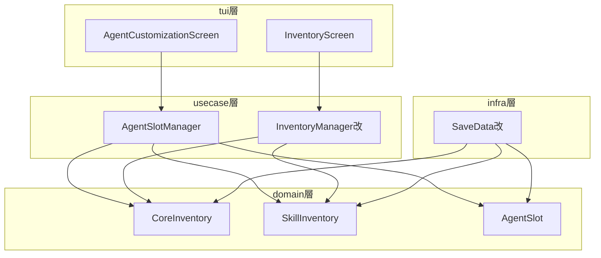
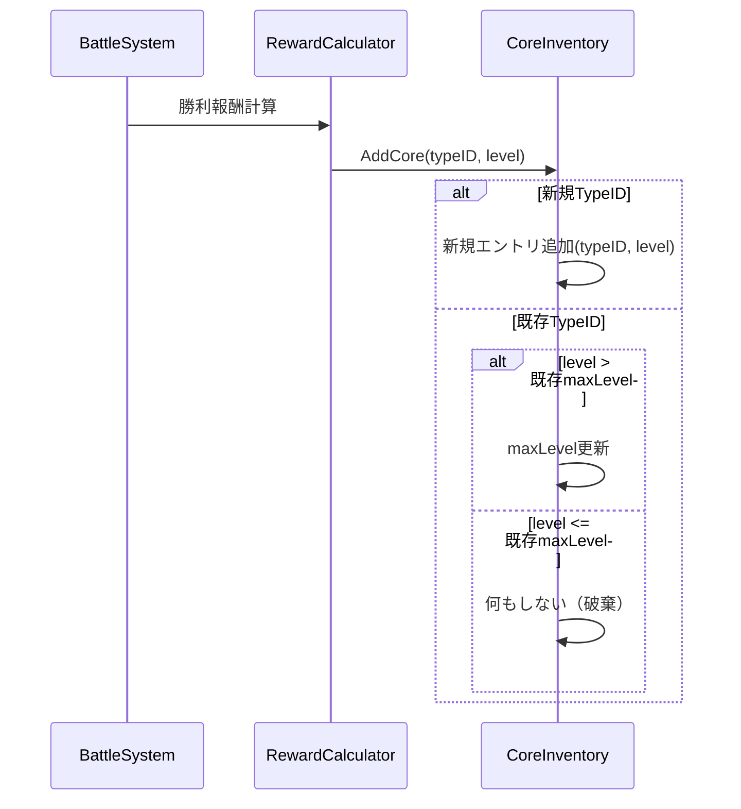
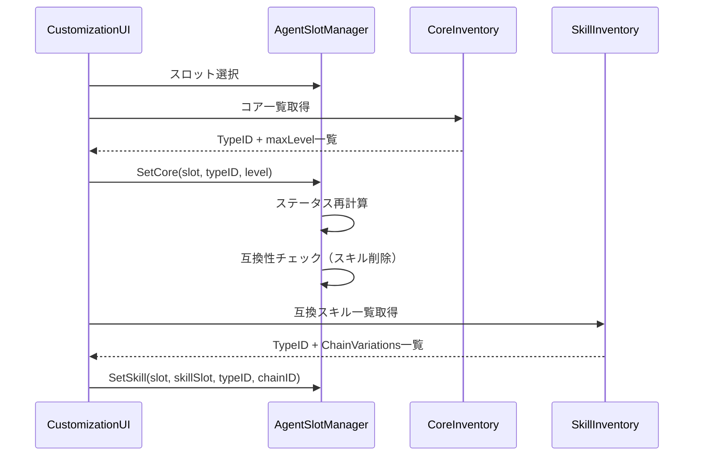
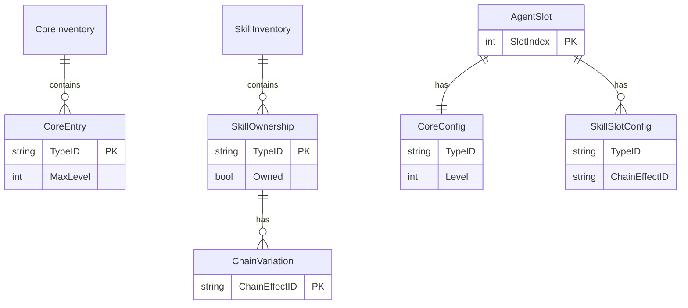

# 技術設計書

## 概要

**目的**: この機能は、コアとスキルのインベントリ管理方式をユニーク管理へ改善し、エージェントカスタマイズシステムを「3スロット個別合成」方式から「3エージェントのコア・スキル自由付け替え」方式へ転換します。

**ユーザー**: プレイヤーはこの機能を使用して、インベントリの冗長性を解消し、戦略に応じてエージェント構成を柔軟に変更できます。

**影響**: 現在のインベントリ管理システム（CoreInventory、SkillInventory、AgentInventory）と合成システム（synthesize.AgentManager）を再設計します。

### 目標

- コアをCoreTypeID + 最大レベルでユニーク管理し、同一特性の重複を排除
- スキルをTypeID + 保有状態 + チェイン効果バリエーションで分離管理
- 3つの固定エージェントスロットによるコア・スキル自由付け替えを実現
- 既存の合成システムを廃止し、新方式へ完全移行
- バトルシステムとの統合を維持

### 非目標

- 旧方式のセーブデータとの互換性維持（旧データは存在しない前提）
- エージェントの成長・レベリングシステム
- スキルのアップグレードシステム
- 4つ以上のエージェントスロット拡張

### ユビキタス言語の変更

本機能の実装に伴い、以下のユビキタス言語（ドメイン用語）を変更します。

| 変更前 | 変更後 | 理由 |
|--------|--------|------|
| Module（モジュール） | Skill（スキル） | エージェントが使用する能力としての意味をより明確に表現するため |

この変更はコードベース全体に適用され、以下に影響します：
- ドメインモデル名（例: `ModuleInventory` → `SkillInventory`）
- メソッド名（例: `AddModule` → `AddSkill`）
- 変数名・フィールド名（例: `modules` → `skills`）
- JSONスキーマのキー名（例: `"modules"` → `"skills"`）
- UIの表示テキスト

### 削除対象

本機能の実装に伴い、以下のモデル・メソッド・構造体を削除します。

#### domain層

| 削除対象 | ファイル | 理由 |
|---------|---------|------|
| `CoreInventory` | `domain/inventory.go` | 新しい`CoreInventory`（TypeID+最大レベル管理）に置き換え |
| `SkillInventory` | `domain/inventory.go` | 新しい`SkillInventory`（TypeID+チェインバリエーション管理）に置き換え |
| `AgentInventory` | `domain/inventory.go` | 合成エージェントの保存が不要になるため削除 |
| `CoreModel` | `domain/core.go` | インスタンス管理が不要になるため削除（CoreTypeのみ使用） |
| `ModuleModel` | `domain/module.go` | インスタンス管理が不要になるため削除（SkillTypeのみ使用） |

#### usecase層

| 削除対象 | ファイル | 理由 |
|---------|---------|------|
| `synthesize.AgentManager` | `usecase/synthesize/agent.go` | 合成機能を廃止するため削除 |
| `synthesize.AgentManager.Synthesize()` | `usecase/synthesize/agent.go` | 合成機能を廃止するため削除 |
| `synthesize.AgentManager.Equip()` | `usecase/synthesize/agent.go` | AgentSlotManagerに置き換え |
| `synthesize.AgentManager.Unequip()` | `usecase/synthesize/agent.go` | AgentSlotManagerに置き換え |
| `session.InventoryManager` | `usecase/session/inventory_manager.go` | 新しい`InventoryManager`に置き換え |

#### infra層

| 削除対象 | ファイル | 理由 |
|---------|---------|------|
| `CoreInstanceSave` | `infra/savedata/savedata.go` | 新スキーマに置き換え |
| `ModuleInstanceSave` | `infra/savedata/savedata.go` | 新スキーマに置き換え |
| `AgentInstanceSave` | `infra/savedata/savedata.go` | 合成エージェントの保存が不要になるため削除 |

#### tui層

| 削除対象 | ファイル | 理由 |
|---------|---------|------|
| `AgentManagementScreen`（合成タブ） | `tui/screens/agent_management.go` | 合成機能を廃止するため削除 |

## アーキテクチャ

### 既存アーキテクチャ分析

現在のシステム構造:
- **domain層**: `CoreInventory`（コアIDマップ管理）、`SkillInventory`（スライス管理）、`AgentInventory`（エージェントIDマップ管理）
- **usecase層**: `synthesize.AgentManager`（合成・装備一元管理）、`session.InventoryManager`（コア・スキル統合管理）
- **infra層**: `savedata`パッケージ（CoreInstanceSave、ModuleInstanceSave形式で永続化）
- **tui層**: `AgentManagementScreen`（合成・装備UI）

現在の課題:
- 同一CoreTypeIDで異なるレベルのコアが複数存在可能（冗長）
- 同一SkillTypeIDで同一ChainEffectのスキルが複数存在可能（冗長）
- 合成でコア・スキルが消費される（再利用不可）
- エージェント構成変更には再合成が必要

### アーキテクチャパターンと境界マップ



**アーキテクチャ統合**:
- 選択パターン: 既存の5層レイヤードアーキテクチャを維持しつつ、ドメイン層のインベントリモデルを再設計
- ドメイン/機能境界: インベントリ管理とエージェントスロット管理を分離し、並行実装を可能に
- 既存パターン保持: Managerパターン、ファクトリパターン、Elm Architectureを継続使用
- 新コンポーネント理由: ユニーク管理の要件を満たすため、新しいドメインモデルが必要
- ステアリング準拠: ドメイン層の独立性、定数の一元管理、型変換のapp層集約を維持

### 技術スタック

| レイヤー | 選択/バージョン | 機能での役割 | 備考 |
|---------|----------------|-------------|------|
| Backend/Services | Go 1.25+ | ドメインロジック、ユースケース実装 | 既存と同一 |
| Data/Storage | JSON (embed.FS) | セーブデータ永続化 | スキーマ変更あり |
| TUI | Bubbletea/Lipgloss | カスタマイズUI | 画面再設計 |

## システムフロー

### コア取得フロー



### エージェントカスタマイズフロー



## 要件トレーサビリティ

| 要件 | 要約 | コンポーネント | インターフェース | フロー |
|------|------|---------------|-----------------|--------|
| 1.1-1.5 | コアのユニーク管理 | CoreInventory | AddCore, GetOwnedCores | コア取得フロー |
| 2.1-2.6 | スキルのユニーク管理 | SkillInventory | AddSkill, GetOwnedSkills | - |
| 3.1-3.4 | エージェントスロットシステム | AgentSlot, AgentSlotManager | GetSlots, IsSlotReady | - |
| 4.1-4.5 | エージェントコア付け替え | AgentSlotManager | SetCore, ClearCore | カスタマイズフロー |
| 5.1-5.7 | エージェントスキル付け替え | AgentSlotManager | SetSkill, ClearSkill | カスタマイズフロー |
| 6.1-6.4 | チェイン効果バリエーション選択 | SkillInventory, AgentSlotManager | GetChainVariations, SetSkill | - |
| 7.1-7.3 | レベル選択によるエージェント調整 | AgentSlotManager | SetCore (level param) | カスタマイズフロー |
| 8.1-8.3 | 既存合成システム廃止 | synthesize.AgentManager削除 | - | - |
| 9.1-9.4 | 装備エージェントのバトル参照 | BattleEngine, AgentSlotManager | BuildAgentsForBattle | - |
| 10.1-10.4 | インベントリUIの更新 | InventoryScreen | - | - |
| 11.1-11.6 | エージェントカスタマイズUIの実装 | AgentCustomizationScreen | - | カスタマイズフロー |

## コンポーネントとインターフェース

### コンポーネント要約テーブル

| コンポーネント | ドメイン/レイヤー | 意図 | 要件カバレッジ | 主要依存 (P0/P1) | コントラクト |
|---------------|-----------------|------|---------------|-----------------|-------------|
| CoreInventory | domain | TypeID+最大レベルでコアをユニーク管理 | 1.1-1.5 | なし | State |
| SkillInventory | domain | TypeID+保有状態+チェインバリエーションでスキル管理 | 2.1-2.6, 6.1-6.4 | ChainEffect (P1) | State |
| AgentSlot | domain | エージェントスロット構成を表現 | 3.1-3.4, 4.1-4.5, 5.1-5.7 | CoreType, SkillType (P0) | State |
| AgentSlotManager | usecase | スロット管理とバトル連携を担当 | 4.1-4.5, 5.1-5.7, 7.1-7.3, 9.1-9.4 | CoreInventory (P0), SkillInventory (P0), AgentSlot (P0) | Service |
| InventoryManager改 | usecase | 改良版インベントリ統合管理 | 1.1-1.5, 2.1-2.6 | CoreInventory (P0), SkillInventory (P0) | Service |
| SaveData改 | infra | 新スキーマでの永続化 | 3.4, 全体 | AgentSlot (P1) | State |
| AgentCustomizationScreen | tui | カスタマイズUI | 11.1-11.6 | AgentSlotManager (P0) | - |
| InventoryScreen | tui | インベントリUI更新 | 10.1-10.4 | InventoryManager改 (P0) | - |

### domain層

#### CoreInventory

| フィールド | 詳細 |
|-----------|------|
| 意図 | コアをCoreTypeIDごとにユニーク管理し、各タイプの取得済み最大レベルのみを保存 |
| 要件 | 1.1, 1.2, 1.3, 1.4, 1.5 |

**責務と制約**
- CoreTypeIDをキーとして、取得済み最大レベルを値とするマップで管理
- 新規コア追加時にレベル比較を行い、高い場合のみ更新
- インベントリ上限は廃止（TypeIDの種類数のみが制約）

**依存関係**
- Inbound: InventoryManager改、RewardCalculator - コア追加・参照 (P0)
- Outbound: なし
- External: なし

**コントラクト**: State [x]

##### 状態管理

```go
// CoreInventory はコアをTypeIDごとにユニーク管理する構造体
type CoreInventory struct {
    // cores はCoreTypeID → 取得済み最大レベルのマップ
    cores map[string]int
}

// AddCore はコアを追加し、レベル比較で更新判定を行う
// 戻り値: 更新されたかどうか
func (inv *CoreInventory) AddCore(typeID string, level int) bool

// GetMaxLevel は指定TypeIDの取得済み最大レベルを返す（未保有は0）
func (inv *CoreInventory) GetMaxLevel(typeID string) int

// GetOwnedCores は保有している全CoreTypeIDとその最大レベルを返す
func (inv *CoreInventory) GetOwnedCores() map[string]int

// HasCore は指定TypeIDのコアを保有しているかを返す
func (inv *CoreInventory) HasCore(typeID string) bool
```

- 永続化: セーブデータで`map[string]int`形式で保存
- 整合性: 追加操作は冪等（同じコアを複数回追加しても結果は同じ）

**実装ノート**
- 統合: 既存の`CoreInventory`を置き換え
- 検証: レベルは1以上の正の整数であること
- リスク: マスタデータに存在しないTypeIDが保存される可能性（起動時検証で対応）

---

#### SkillInventory

| フィールド | 詳細 |
|-----------|------|
| 意図 | スキルをTypeIDごとに保有状態とチェイン効果バリエーションを分離して管理 |
| 要件 | 2.1, 2.2, 2.3, 2.4, 2.5, 2.6, 6.1, 6.2, 6.3, 6.4 |

**責務と制約**
- SkillTypeIDをキーとして、保有状態とチェイン効果IDセットを値として管理
- 同一TypeIDのスキル再取得時、新しいチェイン効果をコレクションに追加
- チェイン効果なしスキルは保有状態のみ更新

**依存関係**
- Inbound: InventoryManager改、RewardCalculator - スキル追加・参照 (P0)
- Outbound: ChainEffect - チェイン効果定義参照 (P1)
- External: なし

**コントラクト**: State [x]

##### 状態管理

```go
// SkillOwnership はスキルの保有情報を表す
type SkillOwnership struct {
    // Owned は保有しているかどうか
    Owned bool
    // ChainVariations は取得済みチェイン効果IDのセット
    ChainVariations map[string]bool
}

// SkillInventory はスキルをTypeIDごとにユニーク管理する構造体
type SkillInventory struct {
    // skills はSkillTypeID → 保有情報のマップ
    skills map[string]*SkillOwnership
}

// AddSkill はスキルを追加し、チェイン効果を登録する
// chainEffectID: チェイン効果ID（なしの場合は空文字列）
func (inv *SkillInventory) AddSkill(typeID string, chainEffectID string)

// GetOwnedSkills は保有している全SkillTypeIDと利用可能なチェイン効果を返す
func (inv *SkillInventory) GetOwnedSkills() map[string]*SkillOwnership

// GetChainVariations は指定TypeIDで利用可能なチェイン効果IDリストを返す
func (inv *SkillInventory) GetChainVariations(typeID string) []string

// HasSkill は指定TypeIDのスキルを保有しているかを返す
func (inv *SkillInventory) HasSkill(typeID string) bool

// HasChainVariation は指定のチェイン効果バリエーションを保有しているかを返す
func (inv *SkillInventory) HasChainVariation(typeID string, chainEffectID string) bool
```

- 永続化: TypeID→ChainEffectIDリストの形式で保存
- 整合性: チェイン効果なしは空文字列で表現し、Ownedフラグで保有を示す

**実装ノート**
- 統合: 既存の`SkillInventory`を置き換え
- 検証: チェイン効果IDはマスタデータに存在すること
- リスク: チェイン効果バリエーションが多すぎる場合のUI表示（ページネーション検討）

---

#### AgentSlot

| フィールド | 詳細 |
|-----------|------|
| 意図 | エージェントスロット1つの構成を表現（コア+スキル4つ） |
| 要件 | 3.1, 3.2, 3.3, 4.1, 4.3, 5.1, 5.2, 7.1, 7.2 |

**責務と制約**
- スロットはコア（TypeID+選択レベル）と最大4つのスキル（TypeID+ChainEffectID）で構成
- コア未設定時はスロット全体が空として扱われる
- スキル設定にはコアとの互換性検証が必要

**依存関係**
- Inbound: AgentSlotManager - 構成管理 (P0)
- Outbound: CoreType, SkillType - マスタデータ参照 (P0)
- External: なし

**コントラクト**: State [x]

##### 状態管理

```go
// SkillSlotConfig はスキルスロットの構成を表す
type SkillSlotConfig struct {
    // TypeID はスキルTypeID（空の場合は未設定）
    TypeID string
    // ChainEffectID はチェイン効果ID（なしの場合は空文字列）
    ChainEffectID string
}

// AgentSlot はエージェントスロット1つの構成を表す
type AgentSlot struct {
    // CoreTypeID はコアTypeID（空の場合はスロット空）
    CoreTypeID string
    // CoreLevel は選択されたコアレベル
    CoreLevel int
    // Skills はスキルスロット構成（最大4つ）
    Skills [4]SkillSlotConfig
}

// IsEmpty はスロットが空かどうかを返す
func (s *AgentSlot) IsEmpty() bool

// GetSkillCount は設定されているスキル数を返す
func (s *AgentSlot) GetSkillCount() int

// Clear はスロットをクリアする
func (s *AgentSlot) Clear()
```

- 永続化: AgentSlotSaveとして保存
- 整合性: CoreTypeIDが空の場合、Skillsも全て空であるべき

**実装ノート**
- 統合: 既存の`AgentModel`装備管理を置き換え
- 検証: CoreLevelは1以上かつ取得済み最大レベル以下
- リスク: スキル互換性チェック漏れ（SetCore時の自動削除で対応）

---

### usecase層

#### AgentSlotManager

| フィールド | 詳細 |
|-----------|------|
| 意図 | 3つのエージェントスロットの管理とバトルシステムとの連携を担当 |
| 要件 | 3.1, 3.2, 3.3, 3.4, 4.1, 4.2, 4.3, 4.4, 4.5, 5.1, 5.2, 5.3, 5.4, 5.5, 5.6, 5.7, 7.1, 7.2, 7.3, 9.1, 9.2, 9.3, 9.4 |

**責務と制約**
- 3つの固定スロットを管理
- コア・スキルの付け替え操作を提供
- バトル用AgentModel構築を担当
- 互換性検証とステータス再計算を実行

**依存関係**
- Inbound: AgentCustomizationScreen - UI操作 (P0)、BattleEngine - バトル用エージェント取得 (P0)
- Outbound: CoreInventory - コア保有確認 (P0)、SkillInventory - スキル保有確認 (P0)、domain.service.StatsService - ステータス計算 (P1)
- External: なし

**コントラクト**: Service [x]

##### サービスインターフェース

```go
// AgentSlotManager は3つのエージェントスロットを管理する
type AgentSlotManager struct {
    slots        [3]*AgentSlot
    coreInv      *domain.CoreInventory
    skillInv    *domain.SkillInventory
    coreTypes    map[string]domain.CoreType
    skillTypes  map[string]domain.SkillType
    passiveSkills map[string]domain.PassiveSkill
}

// NewAgentSlotManager は新しいAgentSlotManagerを作成する
func NewAgentSlotManager(
    coreInv *domain.CoreInventory,
    skillInv *domain.SkillInventory,
    coreTypes map[string]domain.CoreType,
    skillTypes map[string]domain.SkillType,
    passiveSkills map[string]domain.PassiveSkill,
) *AgentSlotManager

// GetSlots は全スロットの構成を返す
func (m *AgentSlotManager) GetSlots() [3]*AgentSlot

// GetSlot は指定スロットの構成を返す
func (m *AgentSlotManager) GetSlot(slot int) *AgentSlot

// SetCore はスロットにコアを設定する
// level: 1から取得済み最大レベルまでの任意のレベル
func (m *AgentSlotManager) SetCore(slot int, typeID string, level int) error

// ClearCore はスロットのコアをクリアする（スキルも全削除）
func (m *AgentSlotManager) ClearCore(slot int) error

// SetSkill はスロットのスキルを設定する
func (m *AgentSlotManager) SetSkill(slot int, skillSlot int, typeID string, chainEffectID string) error

// ClearSkill はスロットのスキルをクリアする
func (m *AgentSlotManager) ClearSkill(slot int, skillSlot int) error

// IsSlotReady はスロットがバトルに使用可能かを返す（コア設定済み）
func (m *AgentSlotManager) IsSlotReady(slot int) bool

// GetReadySlotCount はバトルに使用可能なスロット数を返す
func (m *AgentSlotManager) GetReadySlotCount() int

// BuildAgentsForBattle はバトル用のAgentModelスライスを構築する
func (m *AgentSlotManager) BuildAgentsForBattle() []*domain.AgentModel

// ValidateSkillCompatibility はスキルがスロットのコアと互換性があるかを検証する
func (m *AgentSlotManager) ValidateSkillCompatibility(slot int, skillTypeID string) bool

// GetCompatibleSkills はスロットのコアと互換性のあるスキル一覧を返す
func (m *AgentSlotManager) GetCompatibleSkills(slot int) []string
```

- 事前条件: slot は 0-2 の範囲、skillSlot は 0-3 の範囲
- 事後条件: SetCore後、互換性のないスキルは自動削除
- 不変条件: コア未設定スロットにスキルは設定不可

**実装ノート**
- 統合: 既存の`synthesize.AgentManager`の装備機能を置き換え
- 検証: 同一TypeIDコアは複数スロットに設定可能（要件4.2）
- リスク: バトル中のスロット変更防止（要件9.4 - BattleEngine側で制御）

---

#### InventoryManager（改良版）

| フィールド | 詳細 |
|-----------|------|
| 意図 | 改良版インベントリ統合管理 |
| 要件 | 1.1-1.5, 2.1-2.6 |

**責務と制約**
- CoreInventoryとSkillInventoryを統合管理
- 報酬追加時のインベントリ更新を担当

**依存関係**
- Inbound: GameState, RewardCalculator - インベントリ操作 (P0)
- Outbound: CoreInventory (P0), SkillInventory (P0)
- External: なし

**コントラクト**: Service [x]

##### サービスインターフェース

```go
// InventoryManager はコアとスキルのユニークインベントリを統合管理する
type InventoryManager struct {
    cores   *domain.CoreInventory
    skills *domain.SkillInventory
}

// NewInventoryManager は新しいInventoryManagerを作成する
func NewInventoryManager() *InventoryManager

// Cores はコアインベントリを返す
func (m *InventoryManager) Cores() *domain.CoreInventory

// Skills はスキルインベントリを返す
func (m *InventoryManager) Skills() *domain.SkillInventory

// AddCore はコアを追加する（レベル比較で更新判定）
func (m *InventoryManager) AddCore(typeID string, level int) bool

// AddSkill はスキルを追加する（チェイン効果を登録）
func (m *InventoryManager) AddSkill(typeID string, chainEffectID string)

// GetOwnedCoreTypes は保有コアTypeID一覧を返す
func (m *InventoryManager) GetOwnedCoreTypes() []string

// GetOwnedSkillTypes は保有スキルTypeID一覧を返す
func (m *InventoryManager) GetOwnedSkillTypes() []string
```

- 事前条件: typeIDは有効なマスタデータID
- 事後条件: 追加操作後、インベントリ状態が更新される
- 不変条件: インベントリは常に整合性を保つ

**実装ノート**
- 統合: 既存の`session.InventoryManager`を置き換え
- 検証: 無効なTypeIDは追加時にエラー
- リスク: なし

---

### infra層

#### SaveData（改良版）

| フィールド | 詳細 |
|-----------|------|
| 意図 | 新スキーマでのセーブデータ永続化 |
| 要件 | 3.4, 全体 |

**責務と制約**
- 新しいインベントリ形式とエージェントスロット構成を永続化
- セーブデータバージョンを3.0.0に更新

**コントラクト**: State [x]

##### 状態管理

```go
// CoreInventorySave はユニークコアインベントリのセーブデータ
type CoreInventorySave struct {
    // Cores はCoreTypeID → 最大レベルのマップ
    Cores map[string]int `json:"cores"`
}

// SkillInventorySave はユニークスキルインベントリのセーブデータ
type SkillInventorySave struct {
    // Skills はSkillTypeID → チェイン効果IDリストのマップ
    Skills map[string][]string `json:"skills"`
}

// AgentSlotSave はエージェントスロットのセーブデータ
type AgentSlotSave struct {
    CoreTypeID string                `json:"core_type_id,omitempty"`
    CoreLevel  int                   `json:"core_level,omitempty"`
    Skills    [4]SkillSlotSaveCfg  `json:"skills"`
}

// SkillSlotSaveCfg はスキルスロット構成のセーブデータ
type SkillSlotSaveCfg struct {
    TypeID        string `json:"type_id,omitempty"`
    ChainEffectID string `json:"chain_effect_id,omitempty"`
}

// InventorySaveData（改良版）
type InventorySaveData struct {
    // Cores はユニークコアインベントリ
    Cores CoreInventorySave `json:"unique_cores"`
    // Skills はスキルインベントリ
    Skills SkillInventorySave `json:"skills"`
}

// PlayerSaveData（改良版）
type PlayerSaveData struct {
    // AgentSlots はエージェントスロット構成（3スロット）
    AgentSlots [3]AgentSlotSave `json:"agent_slots"`
}
```

**実装ノート**
- 統合: 既存の`savedata.InventorySaveData`を置き換え
- 検証: ロード時にマスタデータとの整合性を検証
- リスク: 旧セーブデータとの非互換（要件8.3により許容）

---

### tui層

#### AgentCustomizationScreen（サマリーのみ）

| フィールド | 詳細 |
|-----------|------|
| 意図 | エージェントスロットのカスタマイズUI |
| 要件 | 11.1, 11.2, 11.3, 11.4, 11.5, 11.6 |

**責務と制約**
- 3つのエージェントスロットと現在の構成を表示
- コア選択モードとスキル選択モードを提供
- 互換性の視覚的表示

**依存関係**
- Inbound: app.RootModel - シーン遷移 (P1)
- Outbound: AgentSlotManager - スロット操作 (P0)
- External: なし

**実装ノート**
- 統合: 既存の`AgentManagementScreen`の装備タブを置き換え
- 既存の合成タブは廃止
- コア一覧/スキル一覧タブはInventoryScreenに移動

---

#### InventoryScreen（サマリーのみ）

| フィールド | 詳細 |
|-----------|------|
| 意図 | インベントリ確認UI |
| 要件 | 10.1, 10.2, 10.3, 10.4 |

**責務と制約**
- 保有コアTypeIDと最大レベルを表示
- 保有スキルTypeIDとチェイン効果バリエーション数を表示
- 現在装備中のアイテムを示す

**依存関係**
- Inbound: app.RootModel - シーン遷移 (P1)
- Outbound: InventoryManager改 - インベントリ参照 (P0)、AgentSlotManager - 装備状況参照 (P1)
- External: なし

**実装ノート**
- 統合: 既存の`AgentManagementScreen`のコア一覧/スキル一覧タブを移行
- スキル詳細表示時にチェイン効果バリエーション一覧を表示

---

## データモデル

### ドメインモデル

#### 集約とトランザクション境界

1. **CoreInventory集約**
   - ルート: CoreInventory
   - 構成: CoreTypeID→MaxLevelマップ
   - 不変条件: MaxLevelは常に1以上

2. **SkillInventory集約**
   - ルート: SkillInventory
   - 構成: SkillTypeID→SkillOwnership
   - 不変条件: Owned=trueの場合のみChainVariationsが有効

3. **AgentSlot集約**
   - ルート: AgentSlot
   - 構成: CoreConfig + SkillSlotConfig[4]
   - 不変条件: CoreTypeIDが空の場合、全SkillSlotConfigも空

#### エンティティと値オブジェクト



### 論理データモデル

**構造定義**:
- CoreInventory: map[string]int（TypeID→MaxLevel）
- SkillInventory: map[string]*SkillOwnership（TypeID→保有情報）
- AgentSlots: [3]*AgentSlot（固定3スロット）

**整合性ルール**:
- コアのMaxLevelは、該当TypeIDを持つマスタデータが存在する場合のみ有効
- スキルのChainVariationsは、該当ChainEffectIDがマスタデータに存在する場合のみ有効
- AgentSlotのCoreTypeIDは、CoreInventoryに存在するTypeIDのみ設定可能
- AgentSlotのSkillTypeIDは、SkillInventoryに存在するTypeIDのみ設定可能

## エラーハンドリング

### エラー戦略

ドメイン層でのバリデーションエラーはエラー値として返却し、usecase層で適切にハンドリングします。

### エラーカテゴリと対応

**ビジネスロジックエラー**:
- `ErrCoreNotOwned`: 保有していないコアを設定しようとした
- `ErrSkillNotOwned`: 保有していないスキルを設定しようとした
- `ErrChainVariationNotOwned`: 保有していないチェイン効果を選択しようとした
- `ErrSkillIncompatible`: コアと互換性のないスキルを設定しようとした
- `ErrLevelOutOfRange`: 取得済み最大レベルを超えるレベルを選択しようとした
- `ErrSlotIndexOutOfRange`: 無効なスロットインデックス
- `ErrCoreNotSet`: コア未設定スロットにスキルを設定しようとした

### モニタリング

- エラーは`slog`パッケージでWARNレベルでログ出力
- UIではユーザーフレンドリーなエラーメッセージを表示

## テスト戦略

### ユニットテスト

1. **CoreInventory**
   - AddCore: 新規追加、レベル更新、レベル据え置きのケース
   - GetMaxLevel: 保有/未保有のケース
   - GetOwnedCores: 複数タイプ保有のケース

2. **SkillInventory**
   - AddSkill: 新規追加、チェイン効果追加、チェイン効果重複のケース
   - GetChainVariations: バリエーションあり/なしのケース
   - HasChainVariation: 保有/未保有のケース

3. **AgentSlotManager**
   - SetCore: 正常設定、レベル範囲外、未保有コア
   - SetSkill: 正常設定、互換性なし、未保有スキル
   - BuildAgentsForBattle: 空スロット含む、全スロット設定済み

### 統合テスト

1. **インベントリ→スロット連携**
   - コア追加後のスロット設定フロー
   - スキル追加後のスロット設定フロー

2. **スロット→バトル連携**
   - BuildAgentsForBattleの生成AgentModel検証
   - バトル中のスロット変更禁止検証

3. **セーブ/ロード**
   - 新スキーマでの永続化と復元
   - マスタデータ不整合時のフォールバック

### E2Iテスト

1. **カスタマイズフロー**
   - スロット選択→コア設定→レベル選択→スキル設定→チェイン効果選択
   - 互換性フィルタリングの動作確認

2. **インベントリ表示**
   - コア一覧での最大レベル表示
   - スキル詳細でのチェイン効果バリエーション一覧

## セキュリティ考慮事項

ローカルゲームのためセキュリティリスクは限定的ですが、以下を考慮:

- セーブデータの改ざん検出は実装しない（シングルプレイヤーゲームのため）
- マスタデータに存在しないTypeIDがセーブデータに含まれる場合、該当エントリを無視してロード継続

## パフォーマンスとスケーラビリティ

### ターゲットメトリクス

- インベントリ操作: 1ms以下
- スロット構成変更: 1ms以下
- BuildAgentsForBattle: 5ms以下

### 最適化

- ユニーク管理によりインベントリサイズが大幅削減（O(種類数) vs O(取得数)）
- マップベースのアクセスでO(1)検索を維持
