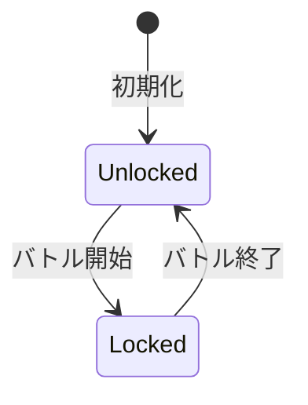

# Agent System

## 概要

エージェントシステムはプレイヤーの戦闘ユニットを管理するドメインです。
3つの固定エージェントスロットに対してコアとスキルを自由に付け替え、バトル用エージェントを構築します。

**実装**: `/internal/domain/agent.go`, `/internal/domain/agent_slot.go`, `/internal/usecase/slot/agent_slot_manager.go`

## 要件

### REQ-AGENT-1: エージェント構成
**種別**: Ubiquitous

The agent system shall construct agents from:
- 1つのコア（Core）
- 最大4つのスキル（Skill）

**受け入れ基準**:
1. 基礎ステータス = コアステータス（特性の重みから固定算出）
2. スキルスロット数 = 4（固定）

### REQ-AGENT-2: コアシステム
**種別**: Ubiquitous

The agent system shall manage cores with:
- 特性（CoreType）: ステータス重み、許可タグ、パッシブスキル
- ステータス計算: 基礎値(100) × 重み（レベル概念なし）

**受け入れ基準**:
1. STR/INT/WIL/LUKの4ステータス
2. 特性ごとに異なるステータス重み
3. 許可タグでスキル互換性を制限
4. 全ステータスが同一の計算式（100 × 重み）

### REQ-AGENT-3: スキルシステム
**種別**: Ubiquitous

The agent system shall manage skills with:
- Effects配列: 複数の効果を持つ
- hp_formula: base + stat_coef × STAT でHP変化量を計算
- タグ: コア特性との互換性判定に使用
- チェイン効果バリエーション: スキルごとに複数のチェイン効果を取得可能

**受け入れ基準**:
1. 各Effectはtarget（enemy/self）で対象を指定
2. タグでコア特性との互換性を判定
3. LUKとluk_factorで確率補正
4. 同一スキルは全エージェント通じて1つのみ装備可能

### REQ-AGENT-4: スロット管理
**種別**: Event-Driven

When プレイヤーがエージェントスロットを設定する, the agent system shall:
- 3つの固定スロットで管理
- コア変更時に互換性のないスキルを自動削除
- バトル中はスロット変更をロック

**受け入れ基準**:
1. 空スロットはバトルに参加しない
2. コアが設定されていないスロットにはスキルを設定不可
3. バトル開始でロック、終了でアンロック

### REQ-AGENT-5: 互換性チェック
**種別**: Ubiquitous

The agent system shall validate skill-core compatibility:
- スキルのタグがコアの許可タグに含まれるか判定

**受け入れ基準**:
1. 1つでも許可タグに一致すれば装備可能
2. 非互換スキルは装備不可
3. UI上で互換性を視覚的に表示

## 仕様

### AgentSlot

**責務**: 1つのエージェントスロット構成を表現する値オブジェクト

**インターフェース**:
- 入力: CoreTypeID, Skills[4]
- 出力: IsEmpty, GetSkillCount

**ルール**:
1. コア未設定で空とみなす
2. スキルスロットは0-3の固定インデックス
3. 検証ロジックはAgentSlotManagerに委譲

### AgentSlotManager

**責務**: 3つのエージェントスロットを管理するユースケース

**機能**:
1. SetCore: スロットにコアを設定
2. SetSkill: スロットにスキルを設定（互換性・重複チェック）
3. ClearCore/ClearSkill: 設定のクリア
4. BuildAgentsForBattle: バトル用AgentModel構築
5. Lock/Unlock: バトル中の変更禁止制御

**状態遷移**:

### CoreInventory

**責務**: コアの保有状態をTypeIDごとにユニーク管理

**ルール**:
1. TypeIDの保有フラグ（bool）を保持
2. 新規TypeIDの追加時にtrueを返す
3. 既に保有しているTypeIDの追加は無視（falseを返す）

### SkillInventory

**責務**: スキルの保有状態をTypeIDごとにユニーク管理

**ルール**:
1. TypeIDと保有フラグを保持
2. チェイン効果バリエーションを分離管理
3. 同一TypeIDの重複取得は既存に統合

## 関連ドメイン

- **Battle**: 装備エージェントのスキルで攻撃発動
- **Game Loop**: スロット構成の永続化
- **Rewarding**: バトル報酬でコア・スキル取得
