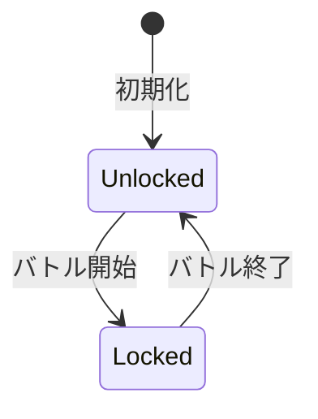

# Agent System

## 概要

エージェントシステムはプレイヤーの戦闘ユニットを管理するドメインです。
3つの固定エージェントスロットに対してコア・スキル・チェイン効果を自由に付け替え、バトル用エージェントを構築します。

**実装**: `/internal/domain/agent.go`, `/internal/domain/agent_slot.go`, `/internal/domain/chain_effect_inventory.go`, `/internal/usecase/slot/agent_slot_manager.go`, `/internal/usecase/inventory/inventory_manager.go`

## 要件

### REQ-AGENT-1: エージェント構成
**種別**: Ubiquitous

The agent system shall construct agents from:
- 1つのコア（Core）
- 最大4つのスキル（Skill）
- 最大4つのチェイン効果（ChainEffect、スキルに紐付く）

**受け入れ基準**:
1. 基礎ステータス = コアステータス（特性の重みから固定算出）
2. スキルスロット数 = 4（固定）
3. チェイン効果スロット数 = 4（スキルスロットと対応）

### REQ-AGENT-2: コアシステム
**種別**: Ubiquitous

The agent system shall manage cores with:
- 特性（CoreType）: ステータス重み、許可タグ、パッシブスキル
- ステータス計算: 基礎値(100) × 重み（レベル概念なし）
- ユニーク制約: 同一コアTypeIDを複数のエージェントスロットに設定不可

**受け入れ基準**:
1. STR/INT/WIL/LUKの4ステータス
2. 特性ごとに異なるステータス重み
3. 許可タグでスキル互換性を制限
4. 全ステータスが同一の計算式（100 × 重み）
5. 3つのエージェント全体で同一コアTypeIDは1つのみ装備可能

### REQ-AGENT-3: スキルシステム
**種別**: Ubiquitous

The agent system shall manage skills with:
- Effects配列: 複数の効果を持つ
- hp_formula: base + stat_coef × STAT でHP変化量を計算
- タグ: コア特性との互換性判定に使用
- ChallengeType: チャレンジ種別（standard / shape / defense）
- ChallengeOptions: チャレンジ固有設定（shapeの場合: `{"shape": "flame"}`等）
- DifficultyRate: タイピング難易度（50-200, 100=標準）

**受け入れ基準**:
1. 各Effectはtarget（enemy/self）で対象を指定
2. タグでコア特性との互換性を判定
3. LUKとluk_factorで確率補正
4. 同一スキルは全エージェント通じて1つのみ装備可能
5. ChallengeTypeでスキル使用時のタイピングチャレンジ種別を指定
6. DifficultyRateでタイピング難易度を指定（EffectTableのColTypingDifficultyで乗算制御可能）

### REQ-AGENT-4: チェイン効果システム
**種別**: Ubiquitous

The agent system shall manage chain effects with:
- 独立インベントリ（ChainEffectInventory）で管理
- スキルスロットごとに最大1つ設定可能
- ユニーク制約: 同一チェイン効果TypeIDを複数のスキルスロット（3エージェント全体）に設定不可
- スキル設定時に該当スロットのチェイン効果を自動クリア

**受け入れ基準**:
1. チェイン効果インベントリがTypeIDごとにユニーク管理される
2. スキルが設定されていないスキルスロットにはチェイン効果を設定不可
3. チェイン効果クリア時に該当スロットのスキルは影響を受けない
4. 3エージェント全体で同一チェイン効果TypeIDは複数スロットに設定不可

### REQ-AGENT-5: スロット管理
**種別**: Event-Driven

When プレイヤーがエージェントスロットを設定する, the agent system shall:
- 3つの固定スロットで管理
- コア変更時に互換性のないスキルを自動削除
- スキルクリア時に対応するチェイン効果を自動削除
- バトル中はスロット変更をロック

**受け入れ基準**:
1. 空スロットはバトルに参加しない
2. コアが設定されていないスロットにはスキルを設定不可
3. スキルが設定されていないスキルスロットにはチェイン効果を設定不可
4. バトル開始でロック、終了でアンロック

### REQ-AGENT-6: 互換性チェック
**種別**: Ubiquitous

The agent system shall validate skill-core compatibility:
- スキルのタグがコアの許可タグに含まれるか判定

**受け入れ基準**:
1. 1つでも許可タグに一致すれば装備可能
2. 非互換スキルは装備不可
3. UI上で互換性を視覚的に表示

## 仕様

### AgentSlot

**責務**: 1つのエージェントスロット構成を表現する値オブジェクト

**インターフェース**:
- 入力: CoreTypeID, Skills[4], ChainEffects[4]
- 出力: IsEmpty, GetSkillCount

**ルール**:
1. コア未設定で空とみなす
2. スキルスロット・チェイン効果スロットは0-3の固定インデックス
3. 検証ロジックはAgentSlotManagerに委譲

**チェイン効果スロット**:
- `ChainEffects [4]ChainEffectSlotConfig`: スキルスロットと対応する配列
- スキル未設定のスロットに対応するチェイン効果は無視される
- スキル削除時に対応するチェイン効果も自動削除

### AgentSlotManager

**責務**: 3つのエージェントスロットを管理するユースケース

**機能**:
1. SetCore: スロットにコアを設定（3エージェント全体のユニーク制約を検証）
2. SetSkill: スロットにスキルを設定（互換性・重複チェック）
3. SetChainEffect: スキルスロットにチェイン効果を設定（スキル必須、ユニーク制約を検証）
4. ClearCore/ClearSkill/ClearChainEffect: 設定のクリア
5. BuildAgentsForBattle: バトル用AgentModel構築（各スキルスロットのチェイン効果を解決）
6. Lock/Unlock: バトル中の変更禁止制御

**制約**:
- SetCore: 同一コアTypeIDが他スロットで使用中の場合はエラー
- SetSkill: スキルクリア時に対応するチェイン効果も自動削除
- SetChainEffect: スキル未設定またはインベントリに未保有の場合はエラー。同一チェイン効果TypeIDが他スロットで使用中の場合もエラー
- ClearCore: スキル全削除と連鎖的にチェイン効果も全削除

**状態遷移**:

### CoreInventory

**責務**: コアの保有状態をTypeIDごとにユニーク管理

**ルール**:
1. TypeIDの保有フラグ（bool）を保持
2. 新規TypeIDの追加時にtrueを返す
3. 既に保有しているTypeIDの追加は無視（falseを返す）

### SkillInventory

**責務**: スキルの保有状態をTypeIDごとにユニーク管理

**ルール**:
1. TypeIDと保有フラグを保持
2. チェイン効果は独立インベントリで管理（参照: ChainEffectInventory）
3. 同一TypeIDの重複取得は既存に統合

### ChainEffectInventory

**責務**: チェイン効果の保有状態をTypeIDごとにユニーク管理

**ルール**:
1. TypeIDの保有フラグを保持（`map[string]struct{}`）
2. 新規TypeIDの追加時にtrueを返す
3. 既に保有しているTypeIDの追加は無視（falseを返す）
4. スキルインベントリと独立した管理

### InventoryManager

**責務**: コア・スキル・チェイン効果の保有状態を統合管理

**機能**:
1. Cores(): CoreInventoryへのアクセス
2. Skills(): SkillInventoryへのアクセス
3. ChainEffects(): ChainEffectInventoryへのアクセス
4. AddCore/AddSkill/AddChainEffect: 各インベントリへの追加

**ルール**:
1. 3つの独立したインベントリを管理
2. スキルとチェイン効果は互いに影響しない

## 関連ドメイン

- **Battle**: 装備エージェントのスキル・チェイン効果で攻撃発動
- **Game Loop**: スロット構成の永続化
- **Rewarding**: バトル報酬でコア・スキル・チェイン効果取得
