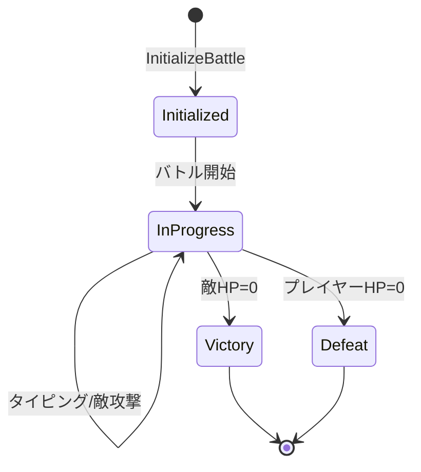

# Battle System

## 概要

バトルシステムはリアルタイム戦闘を管理するドメインです。
タイピング入力に基づくモジュール効果計算、敵の自動攻撃処理、勝敗判定を担当します。

**実装**: `/internal/usecase/combat/battle.go`

## 要件

### REQ-BATTLE-1: バトル初期化
**種別**: Event-Driven

When プレイヤーがバトルを開始する, the battle system shall:
- 指定レベルの敵を生成
- プレイヤーHPを最大値まで回復
- バトル統計を初期化

**受け入れ基準**:
1. 敵レベルはプレイヤー選択値と一致
2. プレイヤーHPはPlayerModelの固定MaxHP（敵撃破により成長、初期値1000）
3. 攻撃タイマーが開始される

### REQ-BATTLE-2: モジュール効果計算
**種別**: Ubiquitous

The battle system shall calculate module effects using:
- HP変化量 = (base + stat_coef × STAT) × SpeedFactor × AccuracyFactor
- 各モジュールは複数のEffectsを持ち、それぞれが独立して発動判定される
- LUKによる確率補正: 補正後確率 = ベース確率 + (LUK - 10) × luk_factor

**受け入れ基準**:
1. 正確性50%未満で効果半減
2. ダメージは最低1保証
3. Effectのtargetに応じた対象（enemy→敵、self→自分）

### REQ-BATTLE-3: 敵攻撃システム
**種別**: State-Driven

While バトル進行中, the battle system shall:
- 敵の攻撃間隔に基づいて自動攻撃を実行
- 次回攻撃の予測ダメージと属性を表示
- 防御バフによるダメージ軽減を適用
- ディフェンスチャレンジ中の敵攻撃: `damage_cut値 × DefenseRate` でダメージ軽減を適用し、攻撃解決後にチャレンジを自動終了

**受け入れ基準**:
1. 攻撃ダメージ = 攻撃力 x (1 - ダメージ軽減率)
2. 最低ダメージ1保証
3. 残り時間をリアルタイム表示
4. ディフェンスチャレンジ中: DefenseProvider.DefenseRate()で軽減率を取得し、攻撃後にCompleteByAttack()でチャレンジ終了

### REQ-BATTLE-4: フェーズ変化
**種別**: Event-Driven

When 敵HPが50%以下になる, the battle system shall:
- 強化フェーズに移行
- 特殊攻撃（自己バフ/プレイヤーデバフ）を解禁

**受け入れ基準**:
1. 30%確率で特殊行動を選択
2. 自己バフ: 攻撃力UP/物理防御UP/魔法防御UP
3. デバフ: タイピング時間短縮/テキストシャッフル/難易度上昇/CD延長

### REQ-BATTLE-5: 勝敗判定
**種別**: Event-Driven

When プレイヤーHP=0, the battle system shall end with defeat.
When 敵HP=0, the battle system shall end with victory.

**受け入れ基準**:
1. 勝利時は報酬画面へ遷移
2. 敗北時はホーム画面へ直接遷移
3. バトル統計を記録

## 仕様

### BattleEngine

**責務**: バトルロジックの中核。初期化、攻撃処理、効果計算、勝敗判定を担当。

**インターフェース**:
- 入力: 敵タイプリスト、エージェント、タイピング結果
- 出力: BattleState、BattleResult

**ルール**:
1. 乱数生成器は初期化時にシード設定
2. 正確性ペナルティ閾値は0.5固定
3. モジュールはEffects配列で複数効果を持つ（カテゴリ廃止）

### BattleState

**責務**: 進行中バトルの状態保持。敵、プレイヤー、装備エージェント、統計を含む。

**状態遷移**:

### EffectTable と時限効果（TimedEffect）

**責務**: バフ/デバフ/パッシブ/チェイン効果の統一管理。

**TimedEffect（時限効果）**:
- **定義**: マスタデータ（timed_effects.json）で定義される一時ステータス（バフ/デバフ）
- **フィールド**:
  - ID: 時限効果の一意識別子（例: "st_str_buff_lv1"）
  - Name: 表示名
  - Description: 説明文
  - Column: 効果列（EffectColumn）
  - Value: 効果値

**AddBuff/AddDebuff の重複処理**:
1. `AddBuff(id, name, duration, values)` / `AddDebuff(id, name, duration, values)` でバフ/デバフを追加
2. 同一ID（TimedEffectID）かつ同一SourceTypeのエントリが既に存在する場合：
   - 新規追加せず、既存エントリのDurationを加算
   - Duration加算後、最大値99.9秒でクランプ
3. 異なるIDのバフ/デバフは別エントリとして共存

**ルール**:
1. パッシブスキル（SourcePassive）とチェイン効果（SourceChain）は重複判定の対象外
2. パッシブ由来のバフ付与（ps_counter_charge等）にもtimed_effect_idが適用される
3. Duration加算の上限は99.9秒（MaxStatusDuration）

### 敵特殊行動

**責務**: 強化フェーズでの敵の特殊行動（自己バフ/プレイヤーデバフ）

**ルール**:
1. 自己バフ持続時間: 10秒
2. プレイヤーデバフ持続時間: 8秒
3. 行動予告を事前表示

### チャレンジ完了時の効果適用

**ChallengeStatusと効果適用の対応**:
- **Success**: ChallengeOutputからTypingResultへ変換し、既存の効果適用パイプライン（ApplySkillEffectWithCombo）を実行。コンボ・パッシブ判定も実行
- **Fail**: 効果なし。タイムアウト時
- **Cancel**: 効果なし。ESCキー押下時

**ディフェンスタイプの特殊処理**:
- チャレンジ終了後の効果適用パイプライン・コンボ・パッシブ判定はすべてスキップ
- リアルタイム軽減（`damage_cut × DefenseRate`）が効果の全て
- ESCキャンセル時もCD/リキャストは消費される（返却しない）

## 関連ドメイン

- **Typing**: チャレンジタイプに応じた入力評価、DefenseProviderによるリアルタイム防御率
- **Agent**: 装備エージェントのモジュールとステータス参照、SkillType.ChallengeType/DifficultyRate
- **Enemy**: 敵パラメータ（HP、攻撃力、間隔）参照、敵行動パターンと時限効果の参照
- **Game Loop**: 報酬画面/ホームへのシーン遷移
