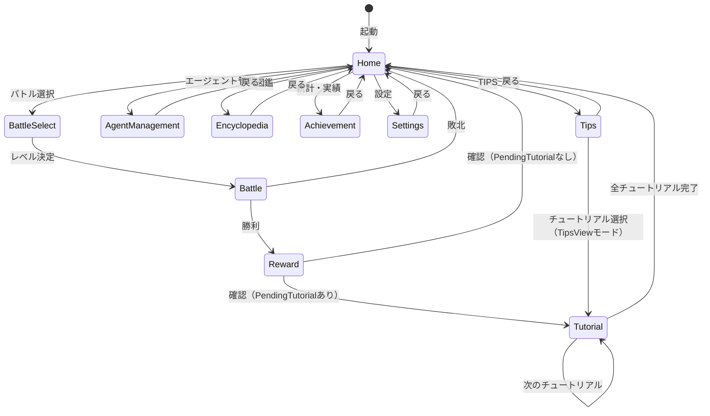

# Game Loop

## 概要

ゲームループはアプリケーション全体の状態管理とシーン遷移を担当するドメインです。
ゲーム状態の永続化（セーブ/ロード）、各画面間のルーティングを管理します。

**実装**: `/internal/app/`

## 要件

### REQ-GAMELOOP-1: シーン管理
**種別**: Ubiquitous

The game loop shall manage scene transitions between:
- Home（メインメニュー）
- BattleSelect（レベル選択）
- Battle（バトル画面）
- Reward（報酬画面）
- AgentManagement（エージェント管理）
- Encyclopedia（図鑑）
- Achievement（統計・実績）
- Settings（設定）
- Tips（TIPS一覧）
- Tutorial（チュートリアル表示）

**受け入れ基準**:
1. 各シーンはtea.Modelインターフェースを実装
2. ChangeSceneMsgでシーン遷移を要求
3. RootModelがルーティングを一元管理

### REQ-GAMELOOP-2: ゲーム状態管理
**種別**: Ubiquitous

The game loop shall maintain GameState including:
- プレイヤー情報（MaxHP、装備エージェント）
- インベントリ（コア、スキル、チェイン効果）
- 敵進行状態（EnemyProgress: ランク・撃破記録）
- ランクアップ報酬マスタデータ（RankReward配列）
- 機能解放マネージャー（FeatureUnlockManager）
- 統計情報（バトル/タイピング統計）
- 実績状態
- 設定

**受け入れ基準**:
1. 各サブシステムはマネージャーを通じてアクセス
2. 外部データ（JSON）の読み込みをサポート
3. エンカウント済み敵リストを追跡
4. 敵進行状態を追跡（ランク解放・撃破記録）

### REQ-GAMELOOP-3: セーブ/ロード
**種別**: Event-Driven

When ゲームを終了する or 特定のタイミング, the game loop shall:
- ゲーム状態をJSON形式で永続化
- ID化最適化によりファイルサイズを削減

**受け入れ基準**:
1. コアはTypeIDのみで保存（レベル概念なし）
2. スキルはTypeIDリストで保存
3. チェイン効果はTypeIDリストで保存（スキルと独立）
4. エージェントスロット設定はコア+スキル+チェイン効果IDリストで保存
5. 敵進行状態（CurrentRank、DefeatRecords）を保存
6. 機能解放状態（各FeatureIDのステータス）を保存
7. 旧セーブデータ（FeatureUnlockフィールドなし）のロード時、CurrentRankから解放状態を再構築
8. 起動時にReconcile処理を実行し、マスタデータ追加分を反映

### REQ-GAMELOOP-4: バトル結果処理
**種別**: Event-Driven

When バトルが終了する, the game loop shall:
- 勝利: 統計更新、撃破記録更新、HP成長、ランク解放チェック、ランクアップ報酬配給、機能解放チェック（ApplyRank）、実績チェック、報酬画面へ遷移
- 敗北: 統計更新、ホーム画面へ直接遷移

**受け入れ基準**:
1. 勝利時に撃破記録を更新（EnemyProgress）
2. 撃破によるHP成長を適用（PlayerModel.MaxHP増加）
3. 同ランク全敵撃破時に次ランクを解放
4. ランク解放時、RankRewardマスタデータから該当報酬を検索
5. ランクアップ報酬のコア・スキル・チェイン効果をインベントリに追加
6. タイピング結果を統計に反映（Score(int)ベース。TotalScore蓄積、AverageScore算出。Score==100でPerfectAccuracyCount加算）
7. 実績達成条件を自動チェック
8. ランクアップ時にApplyRankで該当ランク以下の未解放機能をPendingTutorial化
9. PendingTutorial機能がある場合、報酬画面にチュートリアル誘導を表示
10. 報酬画面からチュートリアル画面へ遷移し、完了後に機能をUnlocked化

## 仕様

### Scene

**責務**: ゲーム内各画面の識別子を定義

**定義**:
```go
const (
    SceneHome Scene = iota
    SceneBattle
    SceneBattleSelect
    SceneAgentManagement
    SceneEncyclopedia
    SceneAchievement
    SceneSettings
    SceneReward
    SceneAgentCustomization
    SceneInventory
    SceneTips
    SceneTutorial
)
```

### GameState

**責務**: ゲーム全体の状態を保持する中核構造体

**インターフェース**:
- 入力: バトル結果、タイピング結果、外部データ
- 出力: SaveData（永続化用）

**ルール**:
1. 敵進行はEnemyProgressで管理（初期ランク1）
2. 挑戦可能な敵は現在ランク以下のランクに属する敵
3. 各マネージャーへのアクセサを提供

### RootModel

**責務**: Bubbleteaアプリケーションのルートモデル。シーンルーティングを担当。

**状態遷移**:


## 関連ドメイン

- **Battle**: バトル結果の受け取りと統計更新
- **Agent**: 装備エージェントの取得
- **Collection**: 実績チェックのトリガー
- **Feature Unlock**: 機能解放チェック・チュートリアル遷移
- **All Domains**: 各シーンへのルーティング
